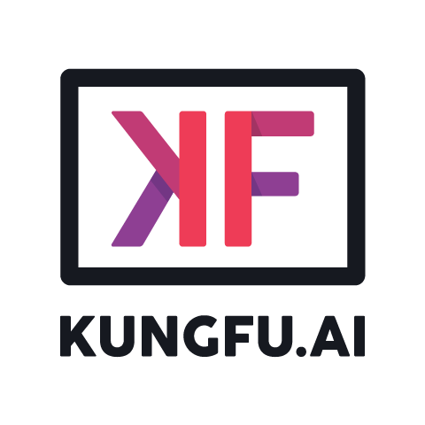

<!-- PROJECT SHIELDS -->
<!-- Note: All URLs are located at the bottom of this README file -->
[![LinkedIn][linkedin-shield]][linkedin-url]

<!-- PROJECT LOGO -->
<br />
<p align="center">
  
  <h3 align="center">KUNGFU.AI Project Template</h3>
  <p align="center">
    Describe what the application does here.
    <br />
    <a href="#launching-the-app"><strong>Launch the application »</strong></a>
  </p>
</p>

<!-- ABOUT THE PROJECT -->
<h2 id="about"> About The Project </h2>
Describe the problems addressed in this project and the solution that was built to address that problem. This should be a high level summary oriented towards a general audience.
<h3 id="built-with"> Built With </h3>

[Python 3.8][python-url]

<h3 id="requirements"> Requirements </h3>

- [Docker][docker-url]
- [Docker Compose][docker-compose-url]
- [NVIDIA Docker Container Runtime][nvidia-url]

<h2 id="getting-started"> Getting Started </h2>

These instructions will get you a copy of the project up and running on your local machine for
development and testing purposes.

Docker is used to ensure consistency across development, test, training, and production
environments. The Docker image is fully self-contained, so all required frameworks and libraries
will be installed as part of the image creation process.

<h3 id="first-time-users"> First Time Users </h3>
If this is your first time using this application, please ensure that you have installed the <a href="#requirements">requirements</a> listed above before proceeding. If you are using MacOS or Linux, you can run this command:

```shell script
brew install git docker
```

And if you are on Windows, you can run this commmand:
```shell script
choco install git docker
```

To get started, start playing with some of the <a href="#command-summary">commands</a> or <a href="#launching-the-app">launch the application locally</a>.

<h3 id="launching-the-app"> Launching the Application </h3>
To launch this application, you need to first build the Docker image using

```shell script
bin/build.sh
```
and then bring up the containers for the application with

```shell script
bin/up.sh
```

The following services will start up:

- FastAPI: You can view the Swagger UI by navigating to http://localhost:8080/docs
- MLFlow: The MLFlow UI will be available at http://localhost:5000

<u>Note</u>: To bring up a particular service, specify the service name (name given in Docker Compose). For example, to bring up just the MLFlow service and not the app, you can run:
```shell script
bin/up.sh mlflow
```

Once you're done working with your application, you can stop all containers and remove the containers, volumes and images associated with the application by running
```shell script
bin/down.sh
```

Below are additional instruction on <a href="#training">training</a> and <a href="#testing">running tests</a> to verify that everything is working.

<h2 id="additional-commands"> Additional Commands </h2>
<h3 id="notebook"> Running Jupyter Lab </h3>
Sometimes, it is helpful to run Jupyter lab if you need a sandbox to explore ideas. We use Jupyter Lab for this purpose and store our notebooks in the notebooks directory in this repository.

To launch Jupyter lab, please run this command:

```shell script
bin/notebook.sh
```

and navigate to http://localhost:8888/lab to access the lab instance.

<h3 id="training"> Training the Model </h3>
To train the model, all you need to do is run this command:

```shell script
bin/train.sh
```

(Note: Please include further instructions if GPU is required!)

<h3 id="training"> Testing the Application </h3>
Once the Docker image is built we can run the project's unit tests to verify everything is
working. The below command will start a Docker container and execute all unit tests using
the [pytest framework](https://docs.pytest.org/en/latest/).

```shell script
bin/test.sh
```

If you want to run a test on a specific file or directory (rather than running all the tests in the tests/ directory), you can use the `-k` flag and list the file path afterwards.

For example, if we specifically wanted to run a test called "test_api", and its file path is as "tests/test_api.py", we can run:

```shell script
bin/test.sh -k test_api.py
```

<h3 id="command-summary"> Summary of Commands </h3>

The `bin/` directory contains basic shell scripts that allow us access to common commands on most environments. We're not guaranteed much functionality on any generic machine, so keeping these basic is important.

The most commonly scripts are:

- `bin/build.sh` - build docker container(s) defined in `Dockerfile` and `docker-compose.yml`
- `bin/test.sh` - run unit tests defined in `tests/`
- `bin/notebook.sh` - instantiate a new jupyter notebook server
- `bin/shell.sh` - instantiate a new bash terminal inside the container
- `bin/train.sh` - train a model

Additional scripts:

- `bin/coverage.sh` - run a coverage report based on a pytest run of `tests/`
- `bin/lint.sh` - check code formatting for the project
- `bin/setup_environment.sh` - sets any build arguments or settings for all containers brought up with docker-compose
- `bin/up.sh` - bring up all containers defined in `docker-compose.yml`
- `bin/down.sh` - stops all containers defined in `docker-compose.yml` and removes associated volumes, networks and images

<h4 id="command-details">Example of How to Use the Commands</h4>
If you want to use the shell script for a specific service listed in your Docker Compose, then you can do that by listing the name of the service after the shell script.

For example, if we wanted to specifically use the shell script to inspect the MLFlow container of an application, we can run:
```shell
bin/shell.sh mlflow
```

Note that this assumes that there is a service in the Docker Compose called "mlflow".

<!-- PROJECT FOOTER -->
<h2 id="footer"> Project Details </h2>
<h3 id="license"> License </h3>

Please read our [license document][license-url] for more information.

<h3 id="Contact"> Contact </h3>

[![KUNGFU.AI][kungfu-shield]][kungfu-url]
[![LinkedIn][linkedin-shield]][linkedin-url]

<!-- MARKDOWN LINKS & IMAGES -->
<!-- https://www.markdownguide.org/basic-syntax/#reference-style-links -->
[license-url]: ./LICENSE.md
[linkedin-shield]: https://img.shields.io/badge/-LinkedIn-black.svg?style=flat-square&logo=linkedin&colorB=555
[linkedin-url]: https://www.linkedin.com/company/kungfuai/
[python-url]: https://www.python.org
[docker-url]: https://www.docker.com
[docker-compose-url]: https://docs.docker.com/compose/install/
[nvidia-url]: https://github.com/NVIDIA/nvidia-container-runtime
[kungfu-shield]: https://img.shields.io/badge/KUNGFU.AI-2022-red
[kungfu-url]: https://www.kungfu.ai